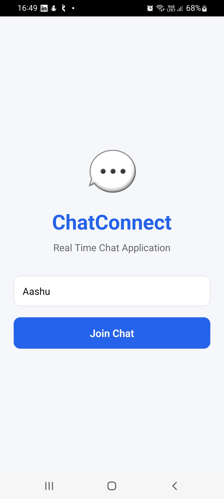
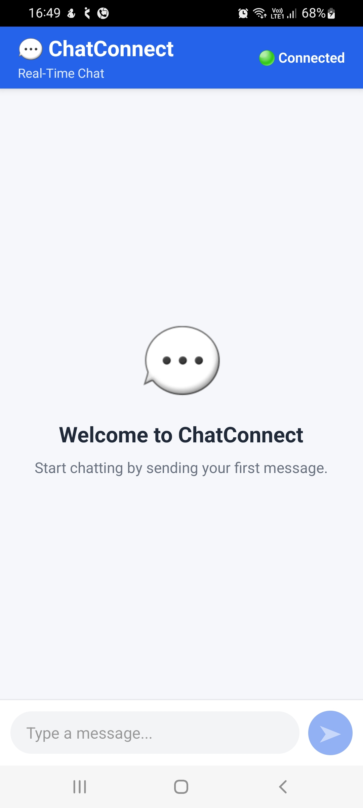
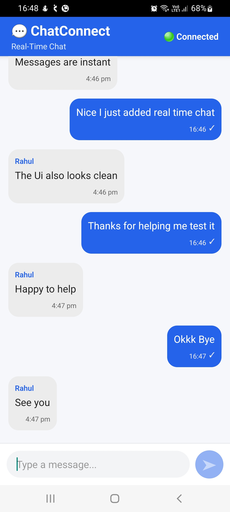
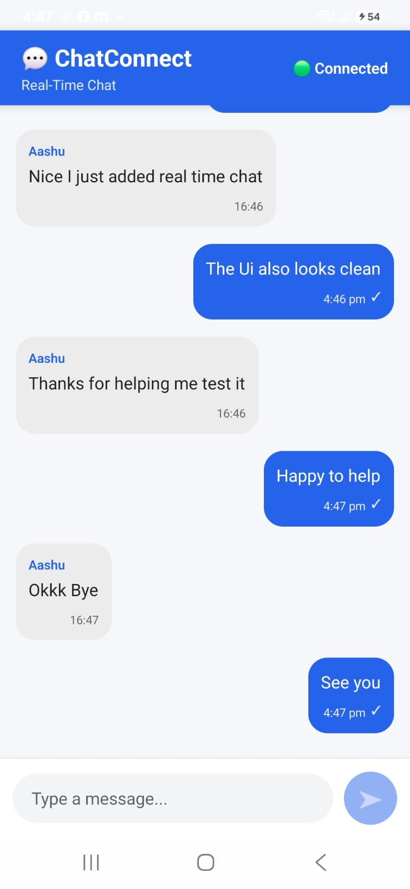
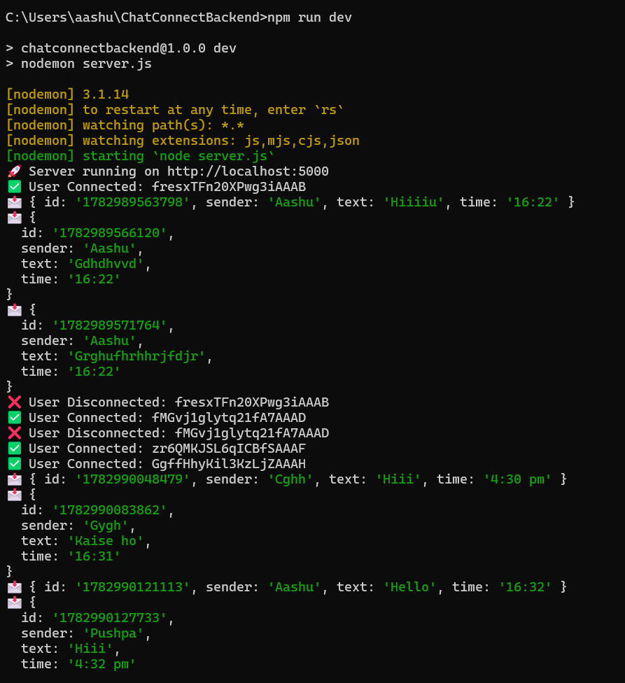

# 💬 ChatConnect

A real-time chat application built using **React Native**, **Node.js**, and **Socket.IO**. The application allows multiple users to exchange messages instantly over a local network with a clean and responsive user interface.

---

## 📱 Demo

🎥 **Screen Recording:** https://drive.google.com/file/d/1SrgJLOrhXueWYTkHy9itNbz72udePx8n/view?usp=drive_link

🔗 **GitHub Repository:** https://github.com/Aashu-Kumar/ChatConnect

📦 **APK File:** https://drive.google.com/file/d/1OH304VMbfiuPODD9Bw7I6YtOhyEb5pDF/view?usp=drive_link

---

## 📖 Project Overview

This project was developed as part of a technical assessment to demonstrate:

- Mobile application development using React Native
- Backend development using Node.js
- Real-time communication using Socket.IO
- Client-server architecture
- Clean project structure and code organization

---

## ✨ Features

- 🔐 Simple Login Screen (Dummy Login)
- 💬 Real-Time Messaging
- ⚡ Instant Message Delivery using Socket.IO
- 📱 Responsive Chat Interface
- 👤 Sender Name Display
- 🟢 Connection Status Indicator
- 🕒 Message Timestamps
- 📜 Auto Scrolling Chat
- 📲 Multi-device Communication
- 🎨 Clean and Modern UI

---

## 🛠 Tech Stack

### Frontend

- React Native
- TypeScript
- React Navigation
- React Native Safe Area Context

### Backend

- Node.js
- Express.js
- Socket.IO
- CORS

---

## 📂 Project Structure

```
ChatConnect
│
├── src
│   ├── components
│   │   ├── Header.tsx
│   │   ├── MessageBubble.tsx
│   │   └── MessageInput.tsx
│   │
│   ├── navigation
│   │   └── AppNavigator.tsx
│   │
│   ├── screens
│   │   ├── LoginScreen.tsx
│   │   └── ChatScreen.tsx
│   │
│   ├── services
│   │   └── socket.ts
│   │
│   └── styles
│       └── colors.ts
│
├── android
├── ios
├── App.tsx
└── package.json
```

---

## 🚀 Getting Started

### Clone the Repository

```bash
git clone https://github.com/Aashu-Kumar/ChatConnect.git
```

```bash
cd ChatConnect
```

---

## Install Dependencies

```bash
npm install
```

---

## ▶️ Start the Backend

Navigate to the backend folder and install dependencies.

```bash
cd ChatConnectBackend
```

```bash
npm install
```

Start the server.

```bash
npm run dev
```

Backend runs on:

```
http://localhost:5000
```

---

## ▶️ Start Metro

```bash
npm start
```

---

## ▶️ Run Android App

```bash
npm run android
```

---


## 📷 Application Screens

| Login Screen | Chat Screen |
|-------------|-------------|
|  |  |

| Real-Time Chat | Multi-Device Demo |
|---------------|-------------------|
|  |  |

### 🖥️ Backend Server

<p align="center">
  
</p>

---

## ⚙️ How It Works

1. User enters a username.
2. App connects to the Socket.IO server.
3. Messages are sent to the backend.
4. Server broadcasts messages to all connected clients.
5. Every connected device receives messages instantly.

---

## 📡 Backend Events

### Client → Server

```
send_message
```

### Server → Client

```
receive_message
```

---

## 🎯 Assignment Requirements Covered

| Requirement | Status |
|-------------|--------|
| React Native Frontend | ✅ |
| Node.js Backend | ✅ |
| Real-Time Messaging | ✅ |
| Socket.IO | ✅ |
| Send Messages | ✅ |
| Receive Messages | ✅ |
| Dummy Login | ✅ |
| Message Timestamp | ✅ |
| Clean Project Structure | ✅ |

---

## 🚀 Future Improvements

- Private One-to-One Chat
- User Authentication
- Online Users List
- Typing Indicator
- Read Receipts
- Message Persistence using MongoDB
- Image & File Sharing
- Push Notifications
- Emoji Support
- Dark Mode

---

## 👨‍💻 Author

**Aashu Kumar**

GitHub: https://github.com/Aashu-Kumar

---

## 📄 License

This project was developed for educational and assessment purposes.